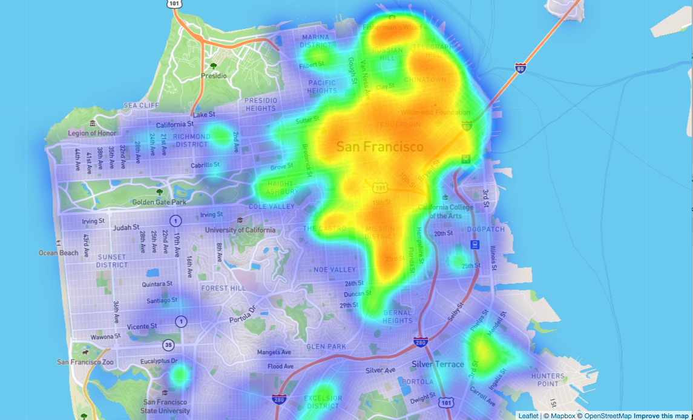
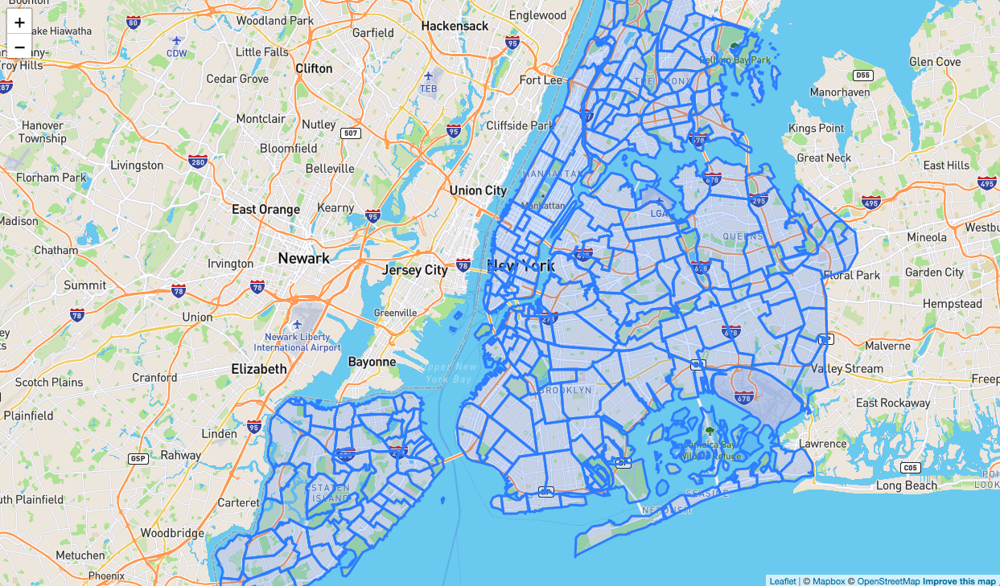
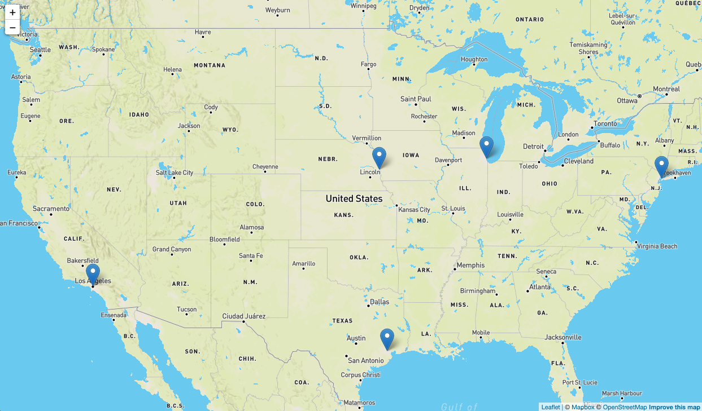

# visualization

## AirBnB Mapping Project

Data Sources:
* NYC - https://www.kaggle.com/dgomonov/new-york-city-airbnb-open-data
* Chicago - https://www.kaggle.com/jinbonnie/chicago-airbnb-open-data
* Seattle - https://www.kaggle.com/airbnb/seattle

Proposal:
We would like to create a vizualization that will help analyze AirBnB listings in three major cities including New York City, Chicago, and Seattle. Example questions we would like to be able to answer are "what are the average AirBnB prices in specific areas of the city?" and "how does price change based on filters such as housing option?".

The vizualization will contain three different layers on a map view as listed below:
1. Heatmap of AirBnB listings
2. Summarized information (e.g. average price) by area
3. Individual pins on AirBnB listings with basic information

## How to Run Code

Clone this repository, add your map API key to the config.js file, and then open the index.html file through your local server. You should be able to navigate through the different pages once on the main page.